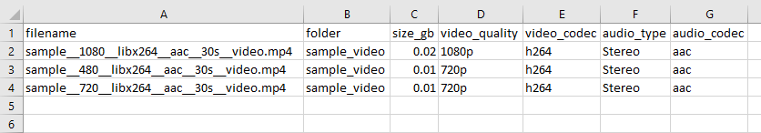

# VideoInfo

## Overview

VideoInfo is a CLI tool written in Python to display media/codec information for video files.

I created this as part of my [Final Project](https://cs50.harvard.edu/python/2022/project/) submission for [CS50P](https://cs50.harvard.edu/python/2022/)


## Why I created this?
I wanted to quick way to scan my video library and see what quality my video files were in (eg. `420p`, `720p`, `1080p`, etc) as well as the type of audio (`stereo`, `surround`, etc) and codecs used.

The purpose of this was so I could determine which files I had that were `720p` or lower, which I would want to update to at least `1080p`.


## Video Demo:
https://youtu.be/S0bZTzMMMN0


## Requirements
- get-video-properties
- pytest

Can install with `pip install -r requirements.txt`

**NOTE:** For Linux systems, `get-video-properties` requires `ffmpeg` to be installed on system. This can be installed on ubuntu/debian based systems as follows:

```sh
sudo apt-get update
sudo apt-get install ffmpeg
```

## Usage
```sh
python project.py [-h] [-c filename] path
```
| Arguments and options               |          |                                                       |
| ----------------------------------- | -------- | ----------------------------------------------------- |
| `path`                              | required | Full path of video file or folder                     |
| `-h`, `--help`                      | optional | Show this help message and exit                       |
| `-c` `filename`, `--csv` `filename` | optional | Output to csv file. Only applies if path is a folder. |

## Examples

### Get info for a video file

Command:
```sh
python project.py ./sample_video/sample__1080__libx264__aac__30s__video.mp4
```

Output:
```python
{
    "filename": "sample__1080__libx264__aac__30s__video.mp4",
    "folder": "sample_video",
    "size_gb": 0.02,
    "video_quality": "1080p",
    "video_codec": "h264",
    "audio_type": "Stereo",
    "audio_codec": "aac"
}
```

### Get info for all video files in a folder and output to csv

Command:
```sh
python project.py -c output.csv ./sample_video/
```

Output:
```python

 {
    "filename": "sample__1080__libx264__aac__30s__video.mp4",
    "folder": "sample_video",
    "size_gb": 0.02,
    "video_quality": "1080p",
    "video_codec": "h264",
    "audio_type": "Stereo",
    "audio_codec": "aac"
}

 {
    "filename": "sample__480__libx264__aac__30s__video.mp4",
    "folder": "sample_video",
    "size_gb": 0.01,
    "video_quality": "720p",
    "video_codec": "h264",
    "audio_type": "Stereo",
    "audio_codec": "aac"
}

 {
    "filename": "sample__720__libx264__aac__30s__video.mp4",
    "folder": "sample_video",
    "size_gb": 0.01,
    "video_quality": "720p",
    "video_codec": "h264",
    "audio_type": "Stereo",
    "audio_codec": "aac"
}
```

CSV File `output.csv`:



## Key files in this repo:

### videoinfo.py
This file defines the class `VideoInfo` which is used by `project.py`.

It utilises the python package [get-video-properties](https://pypi.org/project/get-video-properties/) to set the attributes of the `VideoInfo` class.

### project.py
This is the script that runs the CLI.

It contains the following functions:

| Function                             | Description                                                                                                                                            |
| ------------------------------------ | ------------------------------------------------------------------------------------------------------------------------------------------------------ |
| pretty_video_info(v: VideoInfo)      | For the given VideoInfo object `v`, return a selection of information as a dict                                                                        |
| video_or_folder(path: str)           | For `path` provided, returns `"Video"` or `"Folder"` if `path` is a video file or folder respectively. Returns `None` otherwise.                       |
| quality_from_res(w: int, h: int)     | For a video's width `w` and height `h` provided, return as a string the quality of the video resolution eg. `"4KUHD"`                                  |
| audio_type(channels: int)            | Based on the number of `channels` provided in regards to a video's audio, return as a string the type of audio eg. `"4KUHD"`, `"Stereo"`, `"Surround"` |
| folder_info(path, print_screen=True) | Returns video info for all videos found recursively in `path` as a list of dicts. If `print_screen` is set to `True`, prints info to screen as well.   |

#### video_data_to_csv(data, csv_out):
Outputs list of dicts of video info `data` to a csv.

### test_project.py
For unit testing functions in `project.py`.

Test via pytest:
```sh
pytest test_project.py
```

### sample_video/
This directory contains some sample video files for testing the CLI.
